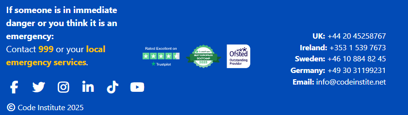

# Purpose of Project
Code Instititute have a duty to identify and support individuals who may be at risk of radicilisation.  This is a one page overview of their strategy.

# Code Institute Prevent Strategy

## Overview

This project is a responsive, accessible, and visually engaging website designed to communicate Code Institute’s Prevent Strategy. The site aims to inform and support individuals and communities in identifying and addressing factors that may lead to radicalisation or extremism. It provides clear guidance, contact information, and a secure form for reporting concerns.

---

## Features & Functions

- **Responsive Navbar:**  

  Fixed at the top, collapses on mobile, with custom color and accessible dropdowns.

- **Introduction Section:**  
  Large, responsive hero image with a prominent tagline, the image changes on larger devices.

- **Background Information:**  
  Information on why the strategy is needed, explaining who is likely to be affected and the impact it can have. 

- **Vulnerability Table:**  NB:See image above

  Bootstrap table with transparent background highlighting contributing factors and vulnerabilities.
  
- **Warning Signs List:**  
  Five bullet points with bold headers and explanations for identifying warning signs.
  
  
  - **Prevent Strategy:**  
  Four key strategy cards (Duty, Training, Collaboration, Tailored Support) displayed in a 2x2 grid on large screens and stacked on mobile.

- **Contact Cards:**  
  Key staff contacts displayed in responsive cards with clickable email links.

- **Speak Up Section:**  NB: see image avove
  Encourages reporting concerns, with a clear call-to-action.

- **Report Form:**  
  Accessible Bootstrap form with required and optional fields for their personal details, styled for clarity and contrast.

- **Footer:**  
  Three-column responsive footer with emergency info, social media icons,3 award logos, and international contact details.

---

## Images

- **Hero Image:**  
  

- **Strategy Images:**  
  Duty and Responsibility  
  Training  
  Collaboration  
  Tailored Support

- **Award Logo:**  
  Footer logo responsive to screen size
   
  
  

---

## Reference Code

- **Bootstrap 5:**  
  [https://getbootstrap.com/] Bootstrap coding was used to insert and format the nav bar, hero image, table including highlighting the row selection, insert and format cards, display the contact section into columns, insert and format the form.

- **Font Awesome:**  
  [https://fontawesome.com/] was used to social media icons.

- **Accessibility:**  
  ARIA labels, visually hidden text, and color contrast improvements are implemented for inclusivity.
  
  - **Javascript Code:**  
  Code Institute had previously provided some javascript that minimised the burger icon once a sub menu item had been selected.
 
 
---

## Brief Description

This site is built to help staff, students, and the wider community understand and engage with the Code Institute’s Prevent Strategy. It highlights key risk factors, provides actionable guidance, and offers direct channels for support and reporting. The design ensures clarity, accessibility, and a professional appearance across all devices.

---

## Credits

- **Code Institute** for strategy content, branding and award logo used within the footer.
- **Bootstrap** and **Font Awesome** for UI components and icons.
- **Ai CoPilot** produced the hero image and the 4 images used on the cards.
- **w3 code checker** was used to find errors in my html and css code which I then manually changed.

---

## Co-Pilot

I heavily relied on Artificial Intelligence for the purpose of this assignment, using AI for more than 90% of the coding and design:

Firstly I used AI to generate the hero image and the images used on the cards.  I asked for the images to use the same colour theme of the company logo.

I used co-pilot prompts to create and modify code for the majority of the site, including the layout, the content and attributes.

Co-pilot was used to produce and reword the majority of the text used on the site to be more appropriate for first time viewers of the topic, using a mixture of the text generated from co-pilot and the strategy document as a starting point.

---

## Lighthouse

 I used lighthouse to evaluate and amend the code to be more accessible for users with visual impairments, mainly modifying the fore-colour and background colours.  The intial feedback gave a score of 94% indiciating a critical but not critical contrast.  

 Further work needs to be done in this area for the following reasons:-
 1) the feedback didnt breakdown all aspects of the site highlighting each element which failed to meet the required minimum standard
 2) after modifying the text:background ration the score did not improve
 3) Menu and text items where only discovered by manually selecting and reviewing the code
 4) the 2 highlighted concerns related to bootstrap layout which didnt make clear the actual visibility or accessibility issue.

## Deployment
From GitHub I first selected the Prevent repository and selected Settings tab.
Under the build and deploy section I selected main and root and clicked save

From the main prevent repository, Under the subheading Deployment I clicked the link 
showing my unique web address.https://natgok.github.io/Prevent/

